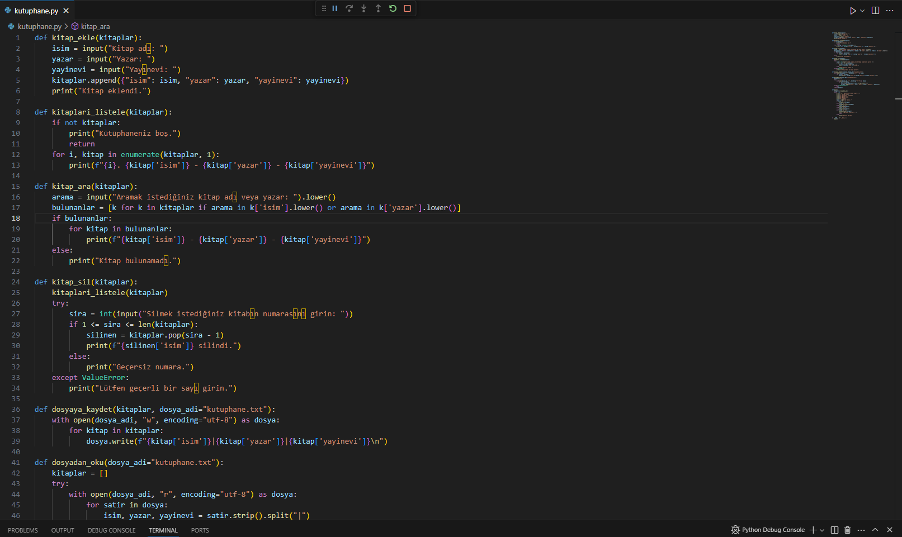

# Kütüphane Takip Sistemi

Bu proje, bir kütüphane için kitapların ve üyelerin takibini sağlayan basit bir sistemdir. Kullanıcılar kitap ekleyebilir, güncelleyebilir, silebilir ve mevcut kitapları listeleyebilirler. Ayrıca üyelerin bilgileri yönetilebilir.

## Özellikler
- Kitap ekleme, silme, güncelleme
- Üye kayıt ve yönetimi
- Kitap ödünç alma ve iade işlemleri
- Kitap ve üye listesi görüntüleme

## Kullanılan Teknolojiler
- C#
- Windows Forms / Console uygulaması (kullandığınız platforma göre belirtin)
- SQL Server / SQLite (veritabanı kullanıldıysa belirtin)

## Kurulum ve Çalıştırma
1. Depoyu klonlayın veya indirin.
2. Gerekli bağımlılıkları yükleyin.
3. Projeyi Visual Studio ile açın.
4. Programı çalıştırın.

## Ekran Görüntüleri

Kod ekranı:  

Çalışmış hali:  

---

## İletişim
Herhangi bir soru veya öneri için iletişime geçebilirsiniz.

---

**Not:** Bu proje kişisel kullanım veya eğitim amaçlı geliştirilmiştir.
